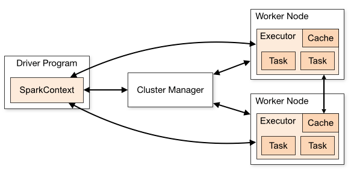

# Where does SPARK fit in HADOOP echo system
      1) SPARK is replacement of MAP REDUCE in hadoop echo system
      2) SPARK is faster than MAP REDUCE because , SPARK does "COMPLETE" in memory computation unlike 
         MAP REDUCE 
      3) MAP REDUCE too uses memory to do computation , But
         MAP REDUCE is designed to operate on (memory + hardisk) as its primary area to 
         store for computations
         That back and forth movement to storage is what makes MAP REDUCE slow.
      4) Spark also utilizes storage when computations , but only when its memory is full .
      5) Spark is designed to operate memory as its primary area to store for computations. 

# SPARK architechture

      1) Spark runs on MASTER SLAVE architechture
      2) These Master and slave nodes are not to be confused with HADOOP HDFS NAMENODE and DATANODE 
      3) Spark's MASTER = DRIVER program
                 SLAVE  = EXECUTOR program
         
         Both Driver and executor programs will run on Worker nodes in CLUSTER
      4) Cluster manager = An external service for acquiring resources on the cluster
         Based on what cluster manager is being used we can decide which mode our Spark cluster is deployed
         example = standalone manager, Mesos, YARN, Kubernetes
      5) Each "WORKER NODE" has one or more "EXECUTROS" and each executor will have one or more "SLOTS"
         One SLOT will be assigned one CPU

# PARTITIONING concept in SPARK

      1) SPARK PARTITIONING can be understood in two different ways :
            WAY 1 :
               DISK PARTITIONS : These are the partitions in which HDFS(or any other storage protocal) decides to store in the disk
               MEMORY PARTITIONS : When Spark data reader reads data into memory , it forms patitions in memory in its own way 
                                   irrespective of how it was stored in DISK
            
            WAY 2 :
               INPUT PARTITIONING : Think of all the already partitioned data in HDFS as one single data set.
                                    Spark data reader decides to read the DATASET while creating the partitions 
                                    in its own way into memory irrespective of how it was partitioned in DISK

                                    While reading into memory , DEFAULT SIZE of single partiton is 128MB
                                    "spark.sql.files.maxPartitionBytes" this config can be set to change the size from 128 MB
               OUTPUT PARTITIONING : While writing on to a disk , dataframe writer 
               SHUFFLE PARTITIONING :
