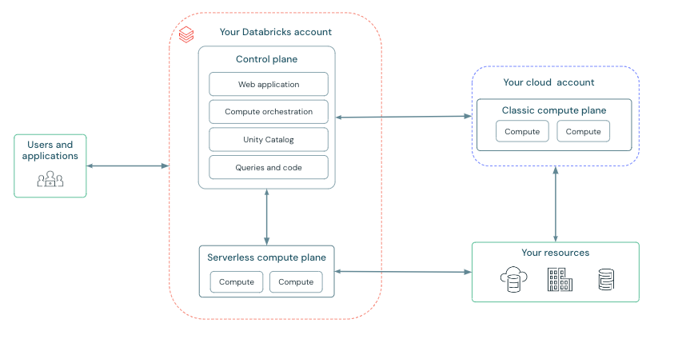

# NEW ARCHITECHTURE IMAGE

# OLD ARCHITECHTURE IMAGE

# CONNECTION of DATABRICKS WORKSPACE to ADLS GEN2 :
	WAY 1 :
		- In databricks there is "DBFS" file system 
		- DBFS is a distributed file system for interacting with cloud object storage.
		- You can see that in CATALOG panel top middle
		- If its not visible for first time you have to enable visibility in settings, follow below steps
			1. Go to the settings page.
			2. Click the Advanced tab.
			3. Click the DBFS File Browser toggle to enable or disable the setting.
		- For mounting any cloud object storage to DBFS , you have to use below command
			configs = {.....} #depending on your authentication method used configs gets keys and values accordingly
			dbutils.fs.mount(
								source = "abfss://<container-name>@<storage-account-name>.dfs.core.windows.net/",
								mount_point = "/mnt/<mount-name>",
								extra_configs = configs
							)
	
	WAY 2:
		- you can use SPARK config method to set whatever config you want to get authenticated 
		- example :
			spark.conf.set("...","...")
		- Number of cings may change according to your choosen authentication type
		- If these configs are set in cluster level then everyone who has access to cluster can use it (less safe)
		- or in your program alone you can set it (more safe)

# Authentication types to connect to cloud OBJECT storage :
	- ACCESS KEYS :
	- Shared Access Signature (SAS) :
	- Service principle

# Architecture elements of AZURE DATA BRICKS :
	Contol plane :
	Compute plane :
			Srverless Compute Plane :
			Classic Compute Plane :
	Data plane :

# Unity catalog heirarchy :
	1. Account level : 
			- Each Account (DataBricks or Azure) can contain N number of Workspaces and M number of 
				metastores(but only one metastore per region)
	2. Metastore :
			- Each metastore can contain N number of catalogs
			- "Hive metastore" , "samples" , "system" , "<your workspace named catalog>" these catalogs come by default
	3. Catalog :
	4. Schema / database :
	5. Tables , Views , functions

	When cluster is not started or not attached there is the following behaviour :
		1) Catalog will show tables present in all schemas except hive metastore
		2) DBFS file browser will show "hive metastore tables" but not normal catalog schema tables

# storage areas of DATA bricks elements :
	Notebooks :
	Results displayed in Notebooks :
	Compute resources :
	Workflows :
	Tables :
        

# Checking how different tables behave :
	- Managed tables (Will always maintain data in DELTA LAKE storage)
	- External tables
	- Views
	- Streaming table
	- Delta LIVE table
	- Streaming live table

	- Copy command
	- Autoloader

	- Permissions on objects

	Managed tables (Will always maintain data in DELTA LAKE storage)
			create or replace table y_most_basic_table 
				as
				(
						select 'r1c1' as COL1 ,'r1c2' as COL2 ,'r1c3' as COL3
				)
	External tables
	Streaming table
	Delta LIVE table
	Streaming live table